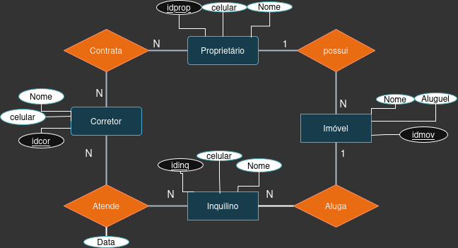

# Modelo ER
-----------



    Uma corretora imobiliaria de imóveis dejesa um sistema que armazene os dados dos
seus proprietários cadastrados e de suas respectivas propriedades e inquilinos.
    Cada Proprietáro pode ter mais de uma propriedade e cada uma tem seu respectivo dono,
as propriedades são alugadas por inquilinos e cada inquilino pode alugar mais de uma propriedade
em diferentes datas.
    Sobre cada casa deve ser armazenado nome, aluguel e endereço contendo o numero da casa, rua e
cep, no inquilino dejesa saber o seu nome e celular para contato e o mesmo é com o proprietario.

## Rodando o Mongo no Docker Cli (terminal)

## Versões mais recentes > mongodb:5
- docker exec -it mongodb mongosh -u root -p root1234

## Versões Mais antigas < mongodb:4.4
- docker exec -it mongodb mongo -u root -p root1234

- Referências (normalização): um documento aponta para outro com ID
- Documentos embutidos (desnormalização): aninhamos os dados dentro de outro documento

# Base de Dados - Versão 1 – Referenced Relationships
```
use imobiliaria

db.createCollection("proprietarios")
db.createCollection("casa")
db.createCollection("inquilinos")
db.createCollection("alugueis")

db.proprietarios.insertOne({ 
  _id: "prop1",
  nome: "Ruan", 
  celular: "(55) 90000-1111",
  imoveis: ["casa1", "casa2"], 
})

db.proprietarios.insertOne({ 
    _id: "prop2",
    nome: "Ursula",
    celular: "(22) 98080-1001",
    imoveis: ["casa3", "casa4"],
})

db.casa.insertMany([
  {
    _id: "casa1",
    nome: "chácara do campestre",
    aluguel: 1500,
    endereco: {
       cep: "12000-000",
       rua: "Rua das Flores",
       numero: 101
       },
    id_prop: "prop1"
  },  
  {
    _id: "casa2",
    nome: "Casa 102",
    aluguel: 2200,
    endereco: {
      cep: "12888-001",
      rua: "Rua das Laranjas",
      numero: 102
    },
    id_prop: "prop1"
  },
  {
    _id: "casa3",
    nome: "Casa 201",
    aluguel: 3100,
    endereco: {
      cep: "12000-222",
      rua: "Av. Central",
      numero: 201
    },
    id_prop: "prop2"
  },
  {
    _id: "casa4",
    nome: "Casa 202",
    aluguel: 3300,
    endereco: {
      cep: "12000-223",
      rua: "Av. Central",
      numero: 202
    },
    id_prop: "prop2"
  }
])

db.inquilinos.insertMany([
  {
    _id: "inq1",
    nome: "Joana Martins",
    celular: "(55) 91111-2222"
  },
  {
    _id: "inq2",
    nome: "Carlos Tavares",
    celular: "(21) 97777-4444"
  },
  {
    _id: "inq3",
    nome: "Ana Souza",
    celular: "(11) 98888-5555"
  }
])

db.alugueis.insertMany([
  {
    _id: "alug1",
    id_casa: "casa1",
    id_inquilino: "inq1",
    data: ISODate("2005-05-01")
  },
  {
    _id: "alug2",
    id_casa: "casa2",
    id_inquilino: "inq2",
    data: ISODate("2015-01-10")
  },
  {
    _id: "alug3",
    id_casa: "casa3",
    id_inquilino: "inq1",
    data: ISODate("2020-03-15")
  },
  {
    _id: "alug4",
    id_casa: "casa4",
    id_inquilino: "inq3",
    data: ISODate("2023-06-01")
  },
  {
    _id: "alug5",
    id_casa: "casa1",
    id_inquilino: "inq3",
    data: ISODate("2025-06-01")
  }
])


```
## Consultas
```
db.casa.find({ aluguel: {$gt: 3000}}).pretty()
    
db.alugueis.aggregate([
  { $match: { data: { $gte: ISODate("2025-01-01") } } },
  { $lookup: {
      from: "casa",
      localField: "id_casa",
      foreignField: "_id",
      as: "casa"
  }},
  { $unwind: "$casa" },
  { $match: { "casa.aluguel": { $lt: 2000 } } },
  { $lookup: {
      from: "inquilinos",
      localField: "id_inquilino",
      foreignField: "_id",
      as: "inquilino"
  }},
  { $unwind: "$inquilino" },
  { $project: {
      _id: 0,
      inquilino: "$inquilino.nome",
      celular: "$inquilino.celular",
      casa: "$casa.nome",
      aluguel: "$casa.aluguel",
      data: 1
  }}
]).pretty()


db.casa.aggregate([
  {
    $lookup: {
      from: "proprietarios",
      localField: "id_prop",
      foreignField: "_id",
      as: "proprietario"
    }
  },
  { $unwind: "$proprietario" }, // desfaz array para acessar campos
  {
    $match: {
      "proprietario.nome": "Ursula"
    }
  },
  {
    $project: {
      _id: 0,
      nome_casa: "$nome",
      aluguel: 1,
      endereco: 1,
      proprietaria: "$proprietario.nome"
    }
  }
]).pretty()

```

# Base de Dados - Versão 2 – Ebedded Relationships

>>>>>>> 17a438b (refactor)

